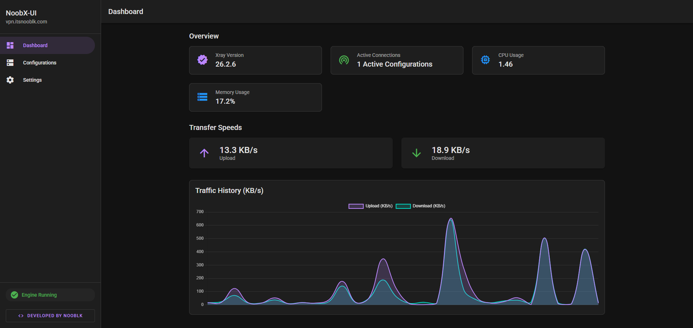
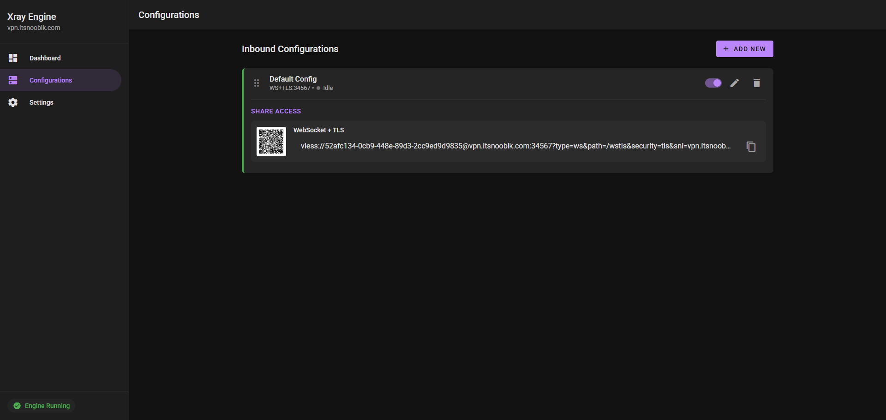

# NoobX-UI - Xray Dashboard

A modern web UI for managing Xray VPN configurations with real-time status monitoring and easy configuration management.

## Quick start

1. Edit `docker-compose.yml` and set your domain:
```yaml
environment:
  - UI_PORT=8088
  - XRAY_DOMAIN=yourdomain.com
```

2. Start the server:
```bash
docker compose up -d --build
```

Open the UI at:

- `http://localhost:8088`

## Features

- **Dashboard** - Real-time monitoring of Xray engine status, CPU usage, memory, and transfer speeds
- **Configurations** - Create, edit, enable/disable multiple Xray inbound configurations
- **Web UI** - Clean Material Design interface with dark mode
- **Port Management** - Prevent port conflicts between configurations
- **Self-signed TLS** - Automatic certificate generation
- **Docker Ready** - One-command deployment with Docker Compose

## Screenshots

### Dashboard
View real-time status, connection info, and system metrics.



### Configurations
Manage multiple Xray configurations easily.



## What you get

- Modern web UI to manage Xray configurations
- Status page showing running state and active connections
- Real-time system monitoring (CPU, memory, traffic)
- Self-signed TLS certs generated on first run in `/data/certs`
- Port conflict detection between configs


## Configuration

Edit these in `docker-compose.yml` under `environment`:

- `XRAY_DOMAIN` - Your domain name (default: `example.com`)
- `UI_PORT` - Web UI port (default: `8088`)

## Notes

- Port `8088` is exposed for the web UI
- Developed by [nooblk](https://github.com/nooblk-98)